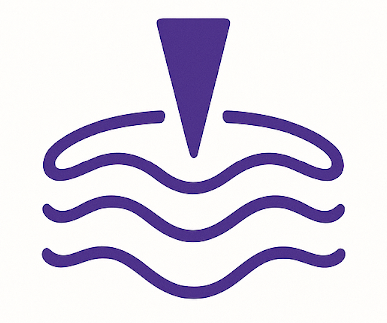

<div align="center">
  
  <h1>DepthScan</h1>
  <p><strong>Advanced AFM Tomography Analysis Tool</strong></p>
</div>

DepthScan is a powerful application for visualizing and analyzing Atomic Force Microscopy (AFM) depth profiles. It provides comprehensive interactive visualization capabilities for AFM tomography data, enabling researchers to explore material properties at different depths with unprecedented clarity and precision.

## Features

- **Data Loading**: Load AFM depth profile images from different directories with flexible file pattern matching
- **Data Processing**: Apply interpolation and contrast enhancement to improve visualization
- **Multiple Visualization Modes**:
  - Profile View: Examine individual depth profiles
  - Heatmap View: Visualize all depth profiles in a 2D heatmap
  - 3D Surface: Explore the full 3D structure of the material
- **Interactive Controls**: Adjust visualization parameters in real-time
- **Scientific Analysis**: Tools designed for detailed material property analysis
- **Machine Learning Integration**:
  - Feature Extraction: Statistical, spectral, and morphological features
  - Clustering: Identify natural groupings in AFM profiles
  - Anomaly Detection: Find unusual or defective regions
  - PCA/t-SNE Visualization: Explore feature space in 2D
  - PCA Components: Visualize what features PCA is detecting in image space
  - Animation: View how features change with depth

## Installation

### Option 1: Using pip

```bash
# Clone the repository
git clone https://github.com/yourusername/depthscan.git
cd depthscan

# Install dependencies
pip install -r requirements.txt
```

### Option 2: Using conda

```bash
# Clone the repository
git clone https://github.com/yourusername/depthscan.git
cd depthscan

# Create and activate conda environment
conda env create -f environment.yml
conda activate afm_tomo_env
```

## Usage

```bash
python app.py
```

Then open your web browser and navigate to http://127.0.0.1:8053/

## Project Structure

```
├── app.py                 # Main Dash application
├── data_loader.py         # Functions for loading AFM depth profile data
├── data_processor.py      # Data processing and interpolation functions
├── colormaps.py           # Custom colormaps for AFM visualization
├── visualizations.py      # Visualization components
├── assets/                # Static assets
│   └── DScan-Logo-2.png   # Application logo
├── ml/                    # Machine learning modules
│   ├── integration.py     # ML integration with Dash
│   ├── feature_extraction.py # Feature extraction methods
│   ├── visualizations.py  # ML visualization components
│   ├── model_trainer.py   # ML model training
│   ├── inference.py       # Model inference
│   └── anomaly_detection.py # Anomaly detection
├── requirements.txt       # Python dependencies
├── environment.yml        # Conda environment specification
├── data/                  # Sample AFM depth profile images
│   └── *.jpg              # AFM images at different depths
└── README.md              # Project documentation
```

## Data Format

The application expects AFM depth profile images with depth information in the filename (e.g., `surface-10micron-deep.jpg`). The images should contain AFM scans at different depths, and the application will extract the central row of each image as the 1D profile.

## Machine Learning Features

### Feature Extraction

DepthScan can extract multiple types of features from AFM profiles:

- **Statistical Features**: Mean, standard deviation, skewness, kurtosis
- **Spectral Features**: Frequency components from Fast Fourier Transform
- **Morphological Features**: Maximum, minimum, peak-to-peak values

### Clustering and Anomaly Detection

The application provides unsupervised learning capabilities:

- **Clustering**: Group similar profiles using K-means, DBSCAN, or spectral clustering
- **Anomaly Detection**: Identify unusual profiles using Isolation Forest, Local Outlier Factor, or One-Class SVM

### Visualization

- **Feature Space**: View extracted features in 2D using PCA or t-SNE
- **PCA Components**: Visualize what features PCA is detecting in the image space
- **Animation**: See how features change across different depths
- **Interactive Selection**: Select points in feature space to highlight corresponding profiles

<!-- ## Citation

If you use this tool in your research, please cite:

```
Author, A. (2025). DepthScan: An advanced platform for analyzing material properties at different depths using AFM tomography. Journal of Scientific Visualization, XX(X), XXX-XXX.
``` -->

## License

MIT

## Contributing

Contributions are welcome! Please feel free to submit a Pull Request.
